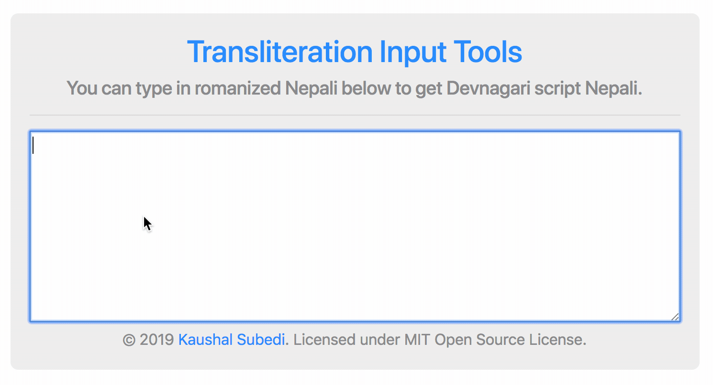

#  Transliteration Input Tools



## [Live Demo](https://ksubedi.github.io/transliteration-input-tools/)

Google had their official input tools that supported transliteration that allowed people to type in languages like Nepali and Arabic using Romanized English which changed the way people typed in a lot of parts of the world. Unfortunately like most projects, Google decided to [kill the API](https://developers.google.com/transliterate/v1/getting_started). Even though it is deprecated, the API still works, however it has a lot of bugs in different browsers and does not support SSL anymore which is pretty much a requirement for most web applications now.

  

I found out that the backend server Google was using is still alive and is being used by different production services like Google Keyboard for Android. I decided to recreate the client from scratch and use the same backend for transliteration.

  

##  Development

Use `npm install` to install all the required node packages. Then run `npm start` to start the `webpack` development server that has a test page, live reload, scss compilation, typescript compilation and everything needed for development.

  

##  Usage

Using this client is very simple. Simply include the `transliteration-input.bundle.js` from the `dist` folder in a script tag on the `head` of your document like this:

`<script type="text/javascript" src="./transliteration-input.bundle.js"></script>`.

  

Add an `input` or `textarea` element in your body:

`<textarea id="transliteration"></textarea>`

  

Then towards the end of your `body` tag, add the following to enable transliteration on any `input` or `textarea` element:

  

````

<script type="text/javascript">

let transliterationInput = document.getElementById("transliteration");

enableTransliteration(transliterationInput, "ne");

</script>

````

  

The second part of the `enableTransliteration` method takes the language code. The following language codes are supported:

````

ENGLISH: 'en'

AMHARIC: 'am'

ARABIC: 'ar'

BENGALI: 'bn'

GREEK: 'el'

GUJARATI: 'gu'

HINDI: 'hi'

KANNADA: 'kn'

MALAYALAM: 'ml'

MARATHI: 'mr'

NEPALI: 'ne'

ORIYA: 'or'

PERSIAN: 'fa'

PUNJABI: 'pa'

RUSSIAN: 'ru'

SANSKRIT: 'sa'

SINHALESE: 'si'

SERBIAN: 'sr'

TAMIL: 'ta'

TELUGU: 'te'

TIGRINYA: 'ti'

URDU: 'ur'

````

  

You can also disable transliteration by calling `disableTransliteration(transliterationInput);` any time.

  

##  Testing

Currently, all the testing is manual. If anyone wants to contribute, automated UI testing would be a great place to do that. All pull requests are welcome.

  

Once all the dependencies are installed, if you run `npm start` it starts `webpack-dev-server` which has live reload, all the compilation and everything needed for you to test the application while developing on a browser.

  

##  Contributing

All pull requests are welcome. Here are some things that you could contribute to:

  

1.  Automated client side tests.

2.  Better mobile compatibility.

3.  Better configuration of the UI.